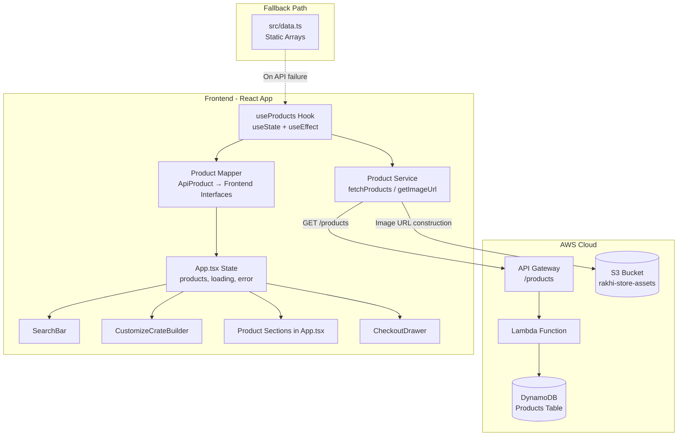

# Design Document: AWS API Product Integration

## Overview

This design replaces the hardcoded product arrays in `src/data.ts` with live data fetched from the existing AWS backend (API Gateway → Lambda → DynamoDB → S3). A new **Product Service** layer handles API communication, a **Product Mapper** transforms API responses into existing frontend TypeScript interfaces, and a **React hook** manages loading/error/success states. The architecture preserves backward compatibility — all existing components (SearchBar, CustomizeCrateBuilder, CheckoutDrawer) continue to work without modification by consuming the same interface types they use today.

### Design Decisions

| Decision | Rationale |
|----------|-----------|
| Dedicated service module at `src/services/productService.ts` | Decouples API logic from React components; easier to test, mock, and swap endpoints |
| Custom React hook (`useProducts`) vs global state library | App is small enough; no need for Redux/Zustand. Hook encapsulates fetch + state. Components receive data via props from App.tsx |
| Fallback to static data after retry failure | Ensures the store is always browsable even when API is down |
| AbortController for cleanup | Prevents memory leaks and state updates on unmounted components |
| Environment variables for URLs | Keeps secrets/config out of source code; supports multiple environments |
| Mapper pattern (not modifying existing interfaces) | Zero changes to existing component code; only data source changes |

---

## Architecture



### Data Flow

1. **App mounts** → `useProducts()` hook fires `useEffect`
2. `productService.fetchProducts()` sends GET to API Gateway with 10s timeout
3. API returns `ApiProduct[]` → service filters by `isActive === true`
4. `productMapper` transforms each `ApiProduct` into the correct frontend interface based on `category`
5. Hook sets state → components re-render with live data
6. On failure → retry once → if still failing, fall back to static data + show banner

---

## Components and Interfaces

### New Files

| File | Purpose |
|------|---------|
| `src/services/productService.ts` | API fetch, image URL builder, error handling |
| `src/services/productMapper.ts` | Transforms `ApiProduct` → frontend interfaces |
| `src/hooks/useProducts.ts` | React hook managing product fetch lifecycle |

### Modified Files

| File | Change |
|------|--------|
| `src/App.tsx` | Replace static imports with `useProducts()` hook; pass live data to children; add loading/error UI |
| `src/components/SearchBar.tsx` | Accept products as props instead of importing from `data.ts` |
| `src/components/CustomizeCrateBuilder.tsx` | Accept products as props instead of importing from `data.ts` |
| `.env` | Add `VITE_API_BASE_URL` and `VITE_S3_BUCKET_URL` |

### Unchanged Files

| File | Reason |
|------|--------|
| `src/types.ts` | No modifications — mapper outputs these exact interfaces |
| `src/data.ts` | Retained as fallback source; static assets (HERO_IMAGES, RELATION_IMAGES, etc.) still imported from here |
| `src/dbService.ts` | Unrelated — handles user auth/cart/orders, not products |
| `src/aws-config.ts` | Unrelated — handles Cognito/DynamoDB client for user data |

---

## Data Models

### ApiProduct (API Response Interface)

```typescript
/** Shape returned by GET /products endpoint */
export interface ApiProduct {
  productId: string;
  name: string;
  description: string;
  price: number;
  currency: string;
  category: string;       // "Gift Boxes" | "Threads" | "Sweets" | "Crate Boxes"
  stock: number;
  featured: boolean;
  isActive: boolean;
  slug: string;
  imageKeys: string[];    // S3 object keys, e.g. "products/RK001/image1.webp"
}
```

### API Response → Frontend Interface Mapping

| API `category` | Target Interface | Key Transformations |
|----------------|-----------------|---------------------|
| `"Gift Boxes"` | `PreCuratedGift` | imageKeys[0] → image, productId → id, extracts relation/badge from description/metadata |
| `"Threads"` | `StandaloneThreadItem` or `RakhiThread` | Determines type based on product attributes; maps relationTags from metadata |
| `"Sweets"` | `PremiumTreat` | Maps sub-category (sweets/dry-fruits/chocolates) from name/description heuristics |
| `"Crate Boxes"` | `CrateBoxStyle` | Direct mapping: id, name, description, price, image |

### Image URL Construction

```typescript
// Base: https://rakhi-store-assets.s3.ap-southeast-2.amazonaws.com/
// Input: "products/RK001/image1.webp"
// Output: "https://rakhi-store-assets.s3.ap-southeast-2.amazonaws.com/products/RK001/image1.webp"

const PLACEHOLDER_IMAGE = '/hero-rakhi.png';

function getImageUrl(imageKey: string): string {
  const baseUrl = import.meta.env.VITE_S3_BUCKET_URL;
  return `${baseUrl}/${imageKey}`;
}

function getPrimaryImage(imageKeys: string[]): string {
  if (!imageKeys || imageKeys.length === 0) return PLACEHOLDER_IMAGE;
  return getImageUrl(imageKeys[0]);
}
```

### Hook State Shape

```typescript
interface UseProductsReturn {
  // Mapped product data
  preCuratedGifts: PreCuratedGift[];
  standaloneThreads: StandaloneThreadItem[];
  rakhiThreads: RakhiThread[];
  premiumTreats: PremiumTreat[];
  crateBoxStyles: CrateBoxStyle[];

  // State flags
  isLoading: boolean;
  error: string | null;
  isFallback: boolean;        // true when showing static data

  // Actions
  retry: () => void;
}
```

### Environment Variables

```env
VITE_API_BASE_URL=https://66n2y032xe.execute-api.ap-southeast-2.amazonaws.com
VITE_S3_BUCKET_URL=https://rakhi-store-assets.s3.ap-southeast-2.amazonaws.com
```

---

## Correctness Properties

*A property is a characteristic or behavior that should hold true across all valid executions of a system — essentially, a formal statement about what the system should do. Properties serve as the bridge between human-readable specifications and machine-verifiable correctness guarantees.*

### Property 1: Image URL Construction

*For any* non-empty string `imageKey`, `getImageUrl(imageKey)` SHALL return a string equal to `VITE_S3_BUCKET_URL + "/" + imageKey`. Additionally, *for any* non-empty `imageKeys` array, `getPrimaryImage(imageKeys)` SHALL return `getImageUrl(imageKeys[0])`.

**Validates: Requirements 1.2, 3.1, 3.3, 8.5**

### Property 2: Active Products Filter Invariant

*For any* array of `ApiProduct` objects with mixed `isActive` values (true/false), after filtering, every product in the resulting array SHALL have `isActive === true`, and no product with `isActive === false` SHALL be present in the result.

**Validates: Requirements 1.6, 9.2**

### Property 3: Error Contains Status Code

*For any* HTTP response with a non-200 status code (in range 400–599), the error thrown by `fetchProducts()` SHALL contain that numeric status code as a substring of the error message.

**Validates: Requirements 1.4, 1.5**

### Property 4: Category-Based Mapping Produces Valid Interface

*For any* valid `ApiProduct` object:
- If `category` is `"Gift Boxes"`, the mapper SHALL produce an object with all required `PreCuratedGift` fields (id, name, description, price, image, rakhiName, sweetsName, relation).
- If `category` is `"Threads"`, the mapper SHALL produce an object with all required `StandaloneThreadItem` fields (id, type, name, description, madeOf, whatsIncluded, price, image) OR `RakhiThread` fields (id, name, description, price, image, relationTags).
- If `category` is `"Sweets"`, the mapper SHALL produce an object with all required `PremiumTreat` fields (id, name, category, description, price, image).
- If `category` is `"Crate Boxes"`, the mapper SHALL produce an object with all required `CrateBoxStyle` fields (id, name, description, price, image).
- No additional fields from the source `ApiProduct` not belonging to the target interface SHALL be present in the output.

**Validates: Requirements 2.3, 8.1, 8.2, 8.3, 8.4, 8.6**

### Property 5: Search Filter Correctness

*For any* query string `q` and any array of search items, every item in the filtered result SHALL have `q` (case-insensitive) as a substring of at least one of: `title`, `description`, `categoryLabel`, or `badge`. Additionally, the count of items per category in the result SHALL equal the actual number of items matching that category in the filtered set.

**Validates: Requirements 10.2, 10.3**

### Property 6: Relationship-Based Thread Filtering

*For any* `RakhiThread` array and any relation tag string (e.g., "brother", "kids", "bhaiya-bhabhi"), filtering by that tag SHALL return only threads whose `relationTags` array contains that tag, and SHALL not exclude any thread that does contain it.

**Validates: Requirements 11.2**

### Property 7: Crate Total Calculation

*For any* valid selection of one `CrateBoxStyle`, one `RakhiThread`, and zero or more `PremiumTreat` items, the calculated crate total SHALL equal `boxStyle.price + rakhi.price + sum(treats.map(t => t.price))`.

**Validates: Requirements 11.3**

---

## Error Handling

### Error Classification

| Scenario | Handling |
|----------|----------|
| Network timeout (>10s) | AbortController fires → catch block → set error state → show retry button |
| HTTP 4xx/5xx | Throw error with status code → set error state → show retry button |
| Malformed JSON | Try/catch around `.json()` → treat as network error |
| Empty response (no products) | Valid state — show "no products available" message |
| Component unmount during fetch | AbortController.abort() in useEffect cleanup → prevent state update |

### Retry Strategy

```
Attempt 1: Fetch from API
  └─ Failure → Attempt 2: Retry immediately
       └─ Failure → Fall back to static data + show banner
```

- Maximum 1 retry (2 total attempts)
- No exponential backoff (these are user-facing page loads, latency matters)
- After fallback, the retry button allows manual re-attempt

### User-Facing Error States

1. **Loading**: Skeleton cards with pulsing animation matching product card dimensions
2. **Error (before fallback)**: Friendly message + "Try Again" button
3. **Fallback active**: Full storefront with dismissible amber banner: "Showing cached catalog. Live data unavailable."
4. **No raw error codes, status numbers, or stack traces** shown to user

---

## Testing Strategy

### Property-Based Tests (fast-check)

The project will use **fast-check** as the property-based testing library for TypeScript. Each property test will run a minimum of **100 iterations**.

| Property | Module Under Test | Tag |
|----------|-------------------|-----|
| Property 1: Image URL Construction | `productService.ts` | Feature: aws-api-product-integration, Property 1: Image URL construction |
| Property 2: Active Filter Invariant | `productService.ts` | Feature: aws-api-product-integration, Property 2: Active products filter invariant |
| Property 3: Error Contains Status Code | `productService.ts` | Feature: aws-api-product-integration, Property 3: Error contains status code |
| Property 4: Category Mapping | `productMapper.ts` | Feature: aws-api-product-integration, Property 4: Category-based mapping produces valid interface |
| Property 5: Search Filter | `SearchBar.tsx` logic | Feature: aws-api-product-integration, Property 5: Search filter correctness |
| Property 6: Relationship Filter | `CustomizeCrateBuilder.tsx` logic | Feature: aws-api-product-integration, Property 6: Relationship-based thread filtering |
| Property 7: Crate Total | `CustomizeCrateBuilder.tsx` logic | Feature: aws-api-product-integration, Property 7: Crate total calculation |

### Unit Tests (Vitest)

- Hook state transitions (loading → success, loading → error → fallback)
- AbortController cleanup on unmount
- Placeholder image returned for empty imageKeys
- Timeout configuration verification
- Development-mode error logging
- Retry button triggers re-fetch
- Dismissible fallback banner behavior

### Integration Tests

- Full render with mocked API: products appear in correct sections
- SearchBar receives and searches through live data
- CustomizeCrateBuilder populates from live data
- Cart/wishlist operations work with live-data products
- Fallback mode preserves all functionality

### Test Configuration

```json
{
  "test-framework": "vitest",
  "pbt-library": "fast-check",
  "min-iterations": 100,
  "test-location": "src/__tests__/",
  "coverage-target": "services/, hooks/"
}
```
